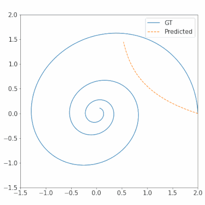

# Neural ODE solvers
Presentation and notebook with four assignments on neural ODE solvers.

The materials were designed for AI Tech spring school held in May 2022 at Politechnika Gdańska, Poland.

## Presentation
Slides from the presentation are available in the `neural_ode_solvers_presentation.pdf` file. They are divided into sections:
1. Introduction.
2. Numerical ODE solvers.
3. Neural network as an ODE (covering adjoint method).
4. Continuous Normalizing Flow (CNF).

## Notebook
The `neural_ode_solvers.ipynb` file contains solved exercises with descriptions, instructions, and unit tests. You can find four models on the following topics:

1. Linear system of two ODEs - stationary dynamic function.

2. 1D ODE - non-stationary dynamic function.

3. MNIST classification.

4. Continuous Normalizing Flow (CNF).
